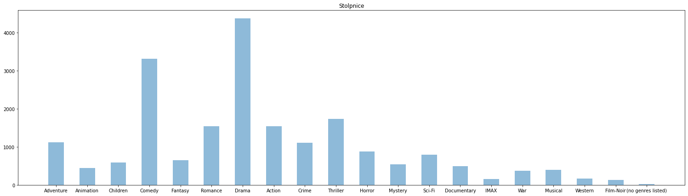

## Priprava podatkov, osnovne statistike in vizualizacija

Podatkovno rudarjenje, naloga, `<21.3.2022>`  
**`Tilen Berlak`**

#### 1. vprašanje:
Kateri filmi so v povprečju najbolje ocenjeni?  Pripravite seznam
filmov ter njihovih povprečnih ocen in izpišite 10 filmov z vrha seznama.
Opazite pri takem ocenjevanju kakšno težavo? Kako bi jo lahko rešili? Kakšni so
rezultati tedaj?


```python
from csv import DictReader

import numpy as np

reader = DictReader(open('podatki/ml-latest-small/ratings.csv', 'rt', encoding='utf-8'))
readerMovies = DictReader(open('podatki/ml-latest-small/movies.csv', 'rt', encoding='utf-8'))

dictionaryRatings = {}

movieIdArray = np.array([], dtype=int);

for row in reader:
    movieId = row["movieId"]
    rating = row["rating"]
    rating = float(rating)
    
    if movieId == 31:
        print(rating + " ")
    
    if (movieId in dictionaryRatings):
        dictionaryRatings[movieId].append(rating)
    else:
        dictionaryRatings[movieId] = [rating]

#print(dictionaryRatings)
# Izračunajmo povprečno oceno filma (id: povprečna ocena)

dictionaryAverageRatings = dictionaryRatings

for movieId in dictionaryRatings:
    dictionaryAverageRatings[movieId] = sum(dictionaryRatings[movieId]) / len(dictionaryRatings[movieId])

dictionaryAverageRatings = sorted(dictionaryAverageRatings.items(), key=lambda x: x[1], reverse=True)
dictionaryAverageRatings = dict(dictionaryAverageRatings)

# Povežemo imena filmov z ocenami

movieTitle = {}

for row in readerMovies:
    movieId = row["movieId"]
    title = row["title"]
    movieTitle[movieId] = title

# Priprava seznama
    
completeList = []
    
for key in dictionaryAverageRatings:
    title = movieTitle[key]
    rating = dictionaryAverageRatings[key]
    completeList.append(key + " " + title + " " + str(rating))

# Izpis zgornjih filmov
    
for i in range(0, 10):
    print(completeList[i])
```

    2086 One Magic Christmas (1985) 5.0
    6598 Step Into Liquid (2002) 5.0
    3879 Art of War, The (2000) 5.0
    1859 Taste of Cherry (Ta'm e guilass) (1997) 5.0
    4302 King Is Alive, The (2000) 5.0
    4731 Innocence (2000) 5.0
    5071 Maelström (2000) 5.0
    5062 Seconds (1966) 5.0
    51471 Amazing Grace (2006) 5.0
    6918 Unvanquished, The (Aparajito) (1957) 5.0
    

Posamezen film dobi oceno od več različnih uporabnikov, zato moramo temu pravilno prilagoditi podatke.

#### 2. vprašanje:
Posamezni film pripada enemu ali več žanrom. 
Koliko je vseh žanrov? Prikaži porazdelitev žanrov z uporabo ustrezne
vizualizacije.


```python
from csv import DictReader

import numpy as np
import matplotlib.pyplot as plt

readerMovies = DictReader(open('podatki/ml-latest-small/movies.csv', 'rt', encoding='utf-8'))

dictGenres = {}

# Preštejemo žanre in jih shranimo v slovar

for row in readerMovies:
    genre = row["genres"]
    genreList = genre.split("|", )
    
    for i in genreList:    
        if (i in dictGenres):
            dictGenres[i] += 1
        else:
            dictGenres[i] = 1

print(dictGenres)

# Pripravimo seznama za žarne

genreList = []
countList = []

for i in dictGenres:
    genreList.append(i)
    countList.append(dictGenres[i])

# Vizualiziramo porazdelitev žanrov    

fig, ax = plt.subplots(figsize=(26, 7))

ax.bar(genreList, countList, align="center", width=0.5, alpha=0.5)
ax.set_title("Stolpnice")
plt.show()

# Koliko je vseh žanrov
print("Število žanrov: " + str((len(genreList)) - 1) )

```

    {'Adventure': 1117, 'Animation': 447, 'Children': 583, 'Comedy': 3315, 'Fantasy': 654, 'Romance': 1545, 'Drama': 4365, 'Action': 1545, 'Crime': 1100, 'Thriller': 1729, 'Horror': 877, 'Mystery': 543, 'Sci-Fi': 792, 'Documentary': 495, 'IMAX': 153, 'War': 367, 'Musical': 394, 'Western': 168, 'Film-Noir': 133, '(no genres listed)': 18}
    


    

    


    Število žanrov: 19
    

Vseh žanrov je 19. Nekateri filmi nimajo navedenega žanra. 
Največ filmov pripada žanru Drama kar 4365.

#### 3. vprašanje:
Kako bi ocenili popularnost posameznih igralcev? Opišite postopek
ocenitve ter izpišite 10 najbolj popularnih igralcev.


```python
from csv import DictReader

import numpy as np
import matplotlib.pyplot as plt

readerCast = DictReader(open('podatki/ml-latest-small/cast.csv', 'rt', encoding='utf-8'))

dictCast = {}

for row in readerCast:
    cast = row["cast"]
    splitList = cast.split("|")
    
    score = 14
    for actor in splitList:
        if actor in dictCast:
            dictCast[actor] += score
        else:
            dictCast[actor] = score
            
        score -= 1
        if score == 0:
            break


dictCast = sorted(dictCast.items(), key=lambda x: x[1], reverse=True)
dictCast = dict(dictCast)   

if '' in dictCast:
    del dictCast['']

count = 10
for actor in dictCast:
    score = dictCast[actor]
    
    if actor != '':
        print(actor + " " + str(score))
        count -= 1
    
    if count == 0:
        break
      
```

    Robert De Niro 834
    Bruce Willis 719
    Nicolas Cage 660
    Michael Caine 646
    Morgan Freeman 603
    Tom Hanks 590
    Clint Eastwood 561
    Robin Williams 553
    John Travolta 553
    John Cusack 549
    

Iz zgornjega seznama lahko razberemo, da je najbolj popularen igralec Robert De Niro.
Zgornji seznam sem dobil na sledeči način:
V datoteki cast.csv sem za vsak film posebaj preveril na katerem zaporednem mestu se nahaja določen igralec.
Nato sem nastavil utež za prvih napisanih 14 igralcev.
Skrajno levo (glavna vloga) je dobil utež 14 ter vsak naslednji za eno manj (13, 12, 11, 10, ...)
Uteži sem seštel ter tako dobil seznam popularnosti igralcev.
